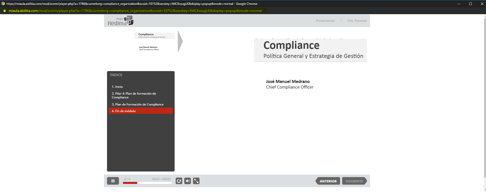

## Como funciona ##
Al abrir un apartado del curso, la web hace llamadas cada 30 segundos a una dirección para verificar que sigues conectado.

Esta aplicación extrae la clave de sesión de la web, y hace la llamada en segundo plano para que puedas seguir trabajando.

### Y dejar la pestaña abierta sin más? ###

Chrome consume RAM, y al bloquear el PC suspende toda actividad. Esto es más ligero. Ale.